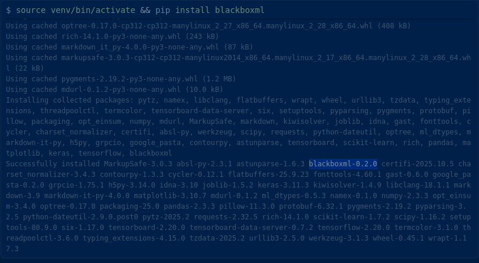

# blackboxml [](https://badge.fury.io/py/blackboxml) [](https://pypi.org/project/blackboxml/) [](./LICENSE) [](https://github.com/stuartasiimwe7/blackboxml/actions/workflows/pages/pages-build-deployment) [](https://pepy.tech/project/blackboxml)


This is a Python package that auto-patches tf.keras.Model.fit() to log training metrics automatically, with zero changes to your code workflow.

## Why?
We have all been there - Training deep learning models can be time-consuming and resource-intensive. And it's all too common to run a lengthy experiment, only to realize afterward that essential training or validation metrics were not logged, making it difficult to analyze or reproduce results.

**BlackBoxML** eliminates this problem by automatically capturing and saving all relevant training metrics—without requiring any changes to your workflow. Whether you're developing CNNs, Transformers, or experimental architectures, BlackBoxML ensures your training history is always preserved and accessible.

- No setup overhead
- No risk of missing critical logs
- Seamless integration: just import and go

You can focus on research and model development, confident that your experiment data is always safe and ready for analysis.

## Project Structure

```
blackboxml/
├── blackboxml/
│   ├── __init__.py
│   ├── autopilot.py
│   ├── visualiser.py
├── setup.py
├── README.md
├── CHANGELOG.md
├── LICENSE
```

## Installation

Follow the steps below to set up your environment and install the package in order to get started:

### Step 1: Create a Virtual Environment

It is recommended to use a virtual environment to manage dependencies.

```bash
python -m venv venv
```

### Step 2: Activate the Virtual Environment

#### On Windows:
```bash
venv\Scripts\activate
```

#### On macOS/Linux:
```bash
source venv/bin/activate
```

### Step 3: Install BlackBoxML

Once the virtual environment is activated, install the package using pip:

```bash
pip install blackboxml
```

### Preview



And now you are all set! 

## How It Works

BlackBoxML integrates seamlessly into your workflow by patching `model.fit()` to log metrics automatically. Here's how you can use it:

### Basic Usage

```python
from blackboxml import autopilot
import tensorflow as tf

# Patch model.fit() once
autopilot()

# Build your model as usual
model = tf.keras.Sequential([...])

model.compile(...)
model.fit(...)  # Metrics are logged automatically
```

### Advanced Usage with Experiment Tracking

For more advanced tracking, you can specify experiment names and tags:

```python
from blackboxml import autopilot

# Use autopilot with experiment details
with autopilot("mnist_cnn", tags=["keras", "cnn", "mnist"]) as tracker:
    model.fit(..., callbacks=[tracker.get_keras_callback()])
```

This approach allows you to organize and tag your experiments for better tracking and analysis.

### Visualizing Metrics

After training, you can visualize the logged metrics using the `visualiser` module:

```python
from blackboxml.visualiser import visualise_metrics

# Visualize after training
visualise_metrics("blackboxml_logs/metrics_20250424_221132.json")
```

This will generate plots for training and validation metrics, helping you analyze your model's performance effortlessly.

## Output

After training your model, **BlackBoxML** will automatically generate a log file containing all the recorded metrics. Here's an example of the output directory structure:

```
blackboxml_logs/
└── metrics_YYYYMMDD_HHMMSS.json
```

Each log file is timestamped for easy identification and contains metrics such as training loss, validation loss, accuracy, and any other metrics tracked during training.
### Sample Metrics File

```json
{
    "accuracy": [0.95, 0.98],
    "loss": [0.1, 0.05],
    "val_accuracy": [0.96, 0.97],
    "val_loss": [0.08, 0.06]
}
```

## Contributing

We welcome contributions of all kinds! Whether it's reporting a bug, suggesting a feature, improving documentation, or submitting a pull request, your help is greatly appreciated. 

Please see our [Contributing Guidelines](./.github/CONTRIBUTING.MD) for more information on how to get started. Together, we can make **BlackBoxML** even better!

To report a bug, please use our [Bug Report Template](./.github/ISSUE_TEMPLATE/bug_report.md). This will help us address issues more efficiently.

To suggest a new feature or enhancement, please use our [Feature Request Template](./.github/ISSUE_TEMPLATE/feature_request.md). Your ideas and feedback are invaluable in improving **BlackBoxML**.

We take security seriously and strive to ensure that **BlackBoxML** is safe to use. If you discover any security vulnerabilities or have concerns, please report them to us immediately by creating an issue or contacting us directly. For more details, refer to our [Security Policy](./.github/SECURITY.MD).

We are committed to fostering an open and welcoming environment for everyone. By participating in this project, you agree to abide by our [Code of Conduct](./.github/CODE_OF_CONDUCT.MD). Please read it to understand the standards we expect from our community members.

## License

This project is licensed under the Apache License 2.0. You are free to use, modify, and distribute this software, provided that you comply with the terms of the license. For more details, see the [LICENSE](./LICENSE) file.

## Author

Built by [Stuart Asiimwe](https://www.linkedin.com/in/stuartasiimwe/)
